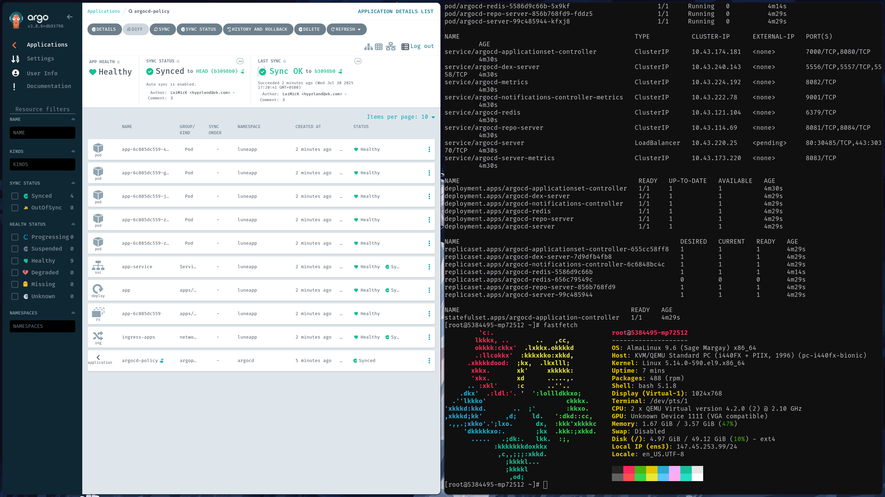

<div align="center">
    <h1>kuster 🌊</h1>
    <h3></h3>
</div>

<div align="center">


</div>


<div align="center">
    <h2>
        ScreenShot
    </h2>
</div>




## Installation

1. Сlone this repository
```bash
git clone https://github.com/MounTemed/kuster
```

2. Buy your vps/vds and install almalinux on it

3. Configure ansible/hosts/inventory.yaml
```yaml
all:
  children:
    servers:
      hosts:
        develop:
          ansible_host: ipv4VPS
          ansible_user: root
```

4. Configure ansible/playbook/kubernetes/secret.yaml
```yaml
- name: Secret docker.login
  hosts: servers
  become: true

  tasks:
    - name: Create Docker registry secret using kubectl equivalent in Ansible
      ansible.builtin.shell: |
        kubectl create secret docker-registry docker-hub-secret --docker-username=root \
          --docker-password=dckr_123_456789 -n luneapp
        kubectl create secret docker-registry docker-hub-secret --docker-username=root \
          --docker-password=dckr_123_456789 -n argocd
```
5. After these steps, you can run Ansible
```yaml
ansible-playbook ansible/playbook/master.yaml
```

## Technologies

| Name          | Description                                                                          |
| ------------- | -------------                                                                        |
| k3s           | A lighter version of Kubernetes that is easy to install, perfect for a mini-project  |
| Terraform     | For creating a VPS through your cloud provider                                       |
| Ansible       | For the automatic configuration of your VPS                                          |
| ArgoCD        | A full-fledged CD that connects to your repository and monitors it                   |
